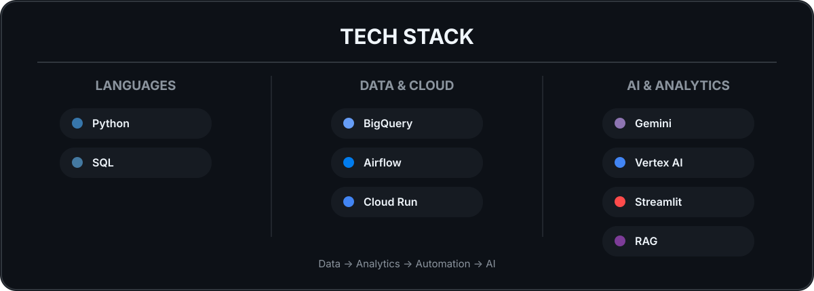
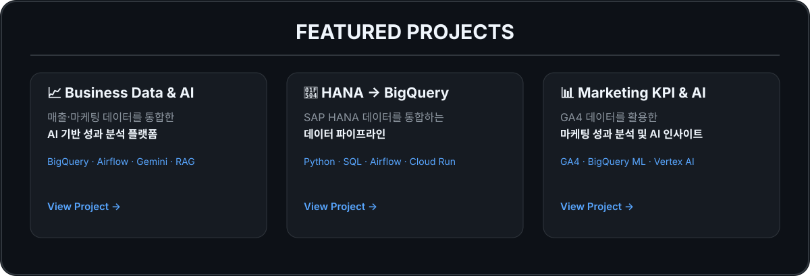

### **데이터를 통합하고, 분석하고, AI로 활용합니다.**

Data Analyst · Analytics Engineering · AI

 

 

 

<a href="https://github.com/qkrwlfjddl/Business-Data-AI-Dashboard">
Business Data & AI Dashboard
</a>
&nbsp; · &nbsp;
<a href="https://github.com/qkrwlfjddl/HANA-BQ-ApacheAirflow">
HANA → BigQuery
</a>
&nbsp; · &nbsp;
<a href="https://github.com/qkrwlfjddl/Marketing-KPI-AI-Insight">
Marketing KPI & AI
</a>

 

## 📚 Research

**LMS Student Analysis & Curriculum Recommendation**

LMS 데이터를 활용한 **학생 분석 및 맞춤형 커리큘럼 추천 연구**

🏆 교내 대학혁신지원사업 우수 연구 사례

 

<a href="https://github.com/qkrwlfjddl/UNIV_STD_Curriculum_Rec">
View Project →
</a>

 

Seoul, Korea

