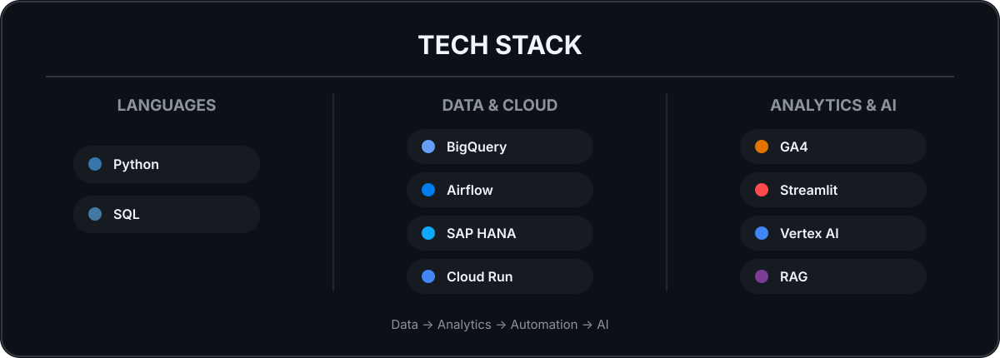

### **데이터를 통합하고, 분석하고, AI로 활용합니다.**

Data Analyst · Analytics Engineering · AI

 

 

### 🚀 Featured Projects

 

<a href="https://github.com/qkrwlfjddl/Business-Data-AI-Dashboard">Business Data & AI</a>
&nbsp;&nbsp;·&nbsp;&nbsp;
<a href="https://github.com/qkrwlfjddl/HANA-BQ-ApacheAirflow">HANA → BigQuery</a>
&nbsp;&nbsp;·&nbsp;&nbsp;
<a href="https://github.com/qkrwlfjddl/Marketing-KPI-AI-Insight">Marketing KPI & AI</a>

  

### 📚 Research

**LMS Student Analysis & Curriculum Recommendation**

🏆 대학혁신지원사업 우수 연구 사례

<a href="https://github.com/qkrwlfjddl/UNIV_STD_Curriculum_Rec">
View →
</a>

